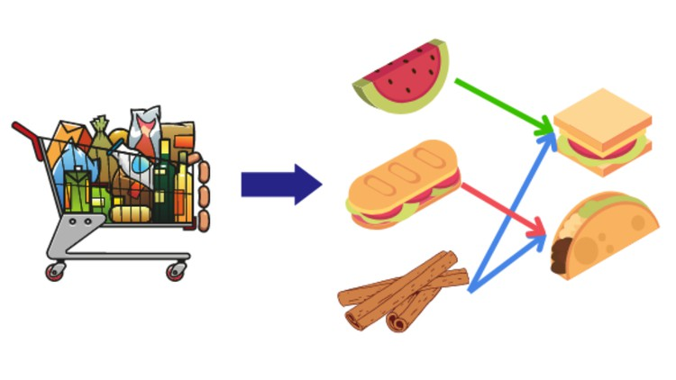
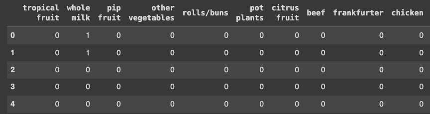
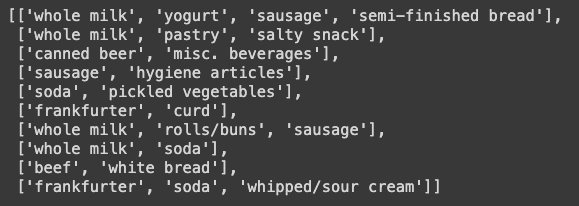
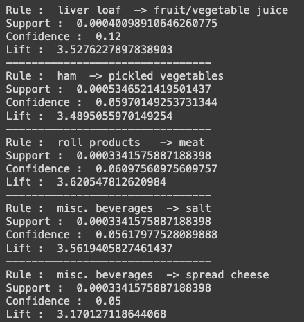
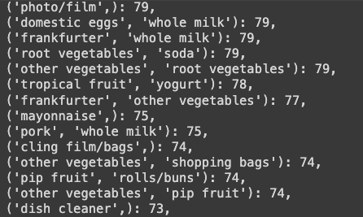
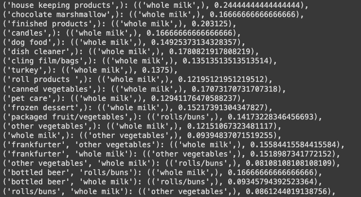

# machine-learning-association-rule-generation
This project is to use machine learning to find out the association in grocery order transactions and generate the learned association rule accordingly.

<!-- PROJECT SHIELDS -->
[![MIT License][license-shield]][license-url]
[![LinkedIn][linkedin-shield]][linkedin-url]

<!-- PROJECT Image -->
 

  

<!-- ABOUT THE PROJECT -->
## About The Project

Machine learning association rule mining has numerous real-life applications across various domains. In this project we will apply the technology in retail and e-commerce industry to perform the market basket analysis. It is to analyze customer purchase patterns to identify frequently co-purchased items and generate association rules. This information is used for product placement, cross-selling, and targeted marketing strategies. For example, a grocery store can place chips and salsa adjacent to each other to increase sales if found customers frequently buy them together.

In this project we will use the 2 most popular association rule mining algorithm: Apriori algorithm and FP-Growth to achieve the result.

### Built With

* Python 3.6
* numpy
* Pandas
* apyori
* pyfpgrowth

(<a href="#readme-top">back to top</a>)

<!-- GETTING STARTED -->
## Getting Started

1. Setup your GPU running machine locally or on the cloud platform
2. Install IPython
3. Clone the git repository
4. Execute the ipython script file in the "code" folder

### Prerequisites

* Basic understanding of python
* Basic knowledge of running python script in IPython environment
* Basic knowledge of neural network structure

### Data Source

A sample grocery transaction csv file containing 38766 customer purchase records. 

(<a href="#readme-top">back to top</a>)

<!-- Script Work Flow Description -->
## IPython Script Work Flow Description

### The ML-association-rule-apyori.ipynb script will execute below steps sequencially

1. Import libraries
2. Import the dataset file
3. Install apyori algorithm
4. Encoding data - assign unique index to each of the record
5. Grouping data by customer and purchase date
6. Change data shape

  

7. Replace numeric values with the corresponding product names 
8. Extracting the items bought per customer and store the items into a list

  

9. Run association rule mining with apyori algorithm 
10. Review the result rule

  

 

### The ML-association-rule-fp-growth.ipynb script will execute below steps sequencially

1. Import libraries
2. Import the dataset file
3. Install fp growth algorithm
4. Encoding data - assign unique index to each of the record
5. Grouping data by customer and purchase date
6. Change data shape
7. Replace numeric values with the corresponding product names
8. Extracting the items bought per customer and store the items into a list
9. Identify frequent patterns with fp growth algorithm. Save the sorted pattern
10. Generate association rules from the sorted pattern.

  

11. Review the result rule

  

(<a href="#readme-top">back to top</a>)

<!-- Key Concepts -->
## Key Concepts

### Apriori algorithm

It is a classic algorithm used for association rule mining in large datasets. It was proposed by Rakesh Agrawal and Ramakrishnan Srikant in 1994. The Apriori algorithm efficiently discovers frequent itemsets and generates association rules from transactional data.

The key idea behind the Apriori algorithm is the "Apriori principle," which states that if an itemset is frequent, then all of its subsets must also be frequent. This principle allows the algorithm to prune the search space by avoiding the generation of candidate itemsets that are not potentially frequent.

### FP-Growth algorithm

The FP-Growth (Frequent Pattern Growth) algorithm is another popular algorithm used for association rule mining, particularly in large transactional databases. It was proposed by Han et al. in 2000 as an improvement over the Apriori algorithm, addressing some of its inefficiencies, especially in handling large datasets.

The key idea behind the FP-Growth algorithm is to compress the transaction database into a compact data structure called the FP-Tree (Frequent Pattern Tree), which represents the frequent itemsets and their relationships. This FP-Tree structure allows for efficient mining of frequent itemsets and generation of association rules.

(<a href="#readme-top">back to top</a>)

<!-- LICENSE -->
## License

Distributed under the MIT License. See `LICENSE.txt` for more information.

(<a href="#readme-top">back to top</a>)

<!-- CONTACT -->
## Contact

Oscar Lee 
Email: mail.oscar.lee@gmail.com 
LinkedIn: [https://www.linkedin.com/in/oscarlee1](https://www.linkedin.com/in/oscarlee1) 
Project Link: [https://github.com/oscarlee711/image-classification-neural-network](https://github.com/oscarlee711/image-classification-neural-network)

(<a href="#readme-top">back to top</a>)

<!-- MARKDOWN LINKS & IMAGES -->
[license-shield]: https://img.shields.io/github/license/othneildrew/Best-README-Template.svg?style=for-the-badge
[license-url]: LICENSE
[linkedin-shield]: https://img.shields.io/badge/-LinkedIn-black.svg?style=for-the-badge&logo=linkedin&colorB=555
[linkedin-url]: https://www.linkedin.com/in/oscarlee1
[Next.js]: https://img.shields.io/badge/next.js-000000?style=for-the-badge&logo=nextdotjs&logoColor=white
[Next-url]: https://nextjs.org/
[React.js]: https://img.shields.io/badge/React-20232A?style=for-the-badge&logo=react&logoColor=61DAFB
[React-url]: https://reactjs.org/
[Vue.js]: https://img.shields.io/badge/Vue.js-35495E?style=for-the-badge&logo=vuedotjs&logoColor=4FC08D
[Vue-url]: https://vuejs.org/
[Angular.io]: https://img.shields.io/badge/Angular-DD0031?style=for-the-badge&logo=angular&logoColor=white
[Angular-url]: https://angular.io/
[Svelte.dev]: https://img.shields.io/badge/Svelte-4A4A55?style=for-the-badge&logo=svelte&logoColor=FF3E00
[Svelte-url]: https://svelte.dev/
[Laravel.com]: https://img.shields.io/badge/Laravel-FF2D20?style=for-the-badge&logo=laravel&logoColor=white
[Laravel-url]: https://laravel.com
[Bootstrap.com]: https://img.shields.io/badge/Bootstrap-563D7C?style=for-the-badge&logo=bootstrap&logoColor=white
[Bootstrap-url]: https://getbootstrap.com
[JQuery.com]: https://img.shields.io/badge/jQuery-0769AD?style=for-the-badge&logo=jquery&logoColor=white
[JQuery-url]: https://jquery.com 
